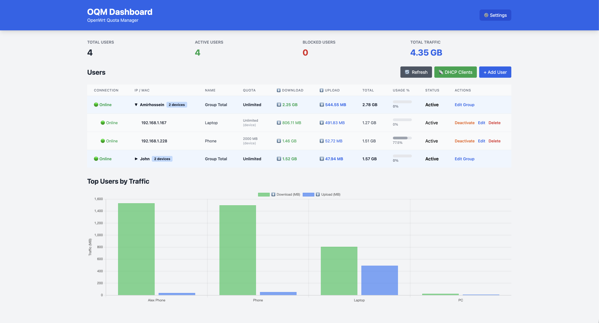

# 🌐 OQM - OpenWrt Quota Manager

[](https://opensource.org/licenses/MIT)
[](https://golang.org)
[](https://openwrt.org)

A powerful and lightweight quota management system for OpenWrt routers. Monitor network usage, enforce quota limits, and manage users with an intuitive web interface.

## ✨ Features

- 📊 **Real-time Traffic Monitoring** - Track upload/download for each user
- 🎯 **Dual Quota System** - Device quota + Group quota (shared among devices)
- 🚫 **Smart Auto-Block/Unblock** - Auto-block when quota exceeded, auto-unblock when quota increased
- 📱 **Smart Notifications** - Telegram & Bale support with detailed usage info (used MB, quota, warnings)
- 🖥️ **Modern Web UI** - Beautiful dashboard with real-time stats and charts
- 👥 **Multi-Device Grouping** - Group unlimited devices per user with shared quotas
- 🆔 **Flexible User Tracking** - Track by IP address or MAC address (with ARP resolution)
- ⏰ **Scheduled Resets** - Daily, weekly, or monthly quota resets
- 🔧 **Powerful CLI** - Full command-line interface for automation
- 🪶 **Ultra Lightweight** - Single binary (~5-7MB), minimal resource usage (<15MB RAM)
- 🔒 **nftables Integration** - Native firewall with accurate kernel-level counting
- 📡 **DHCP Integration** - Auto-discover and add new devices from DHCP leases

## 📸 Screenshots

### Dashboard


## 🚀 Quick Start

Get OQM running in 5 minutes!

### Method 1: Automated Installation (Recommended)

```bash
# Download and run install script
wget -O - https://raw.githubusercontent.com/abdollahzadehghalejoghi/oqm/main/scripts/install.sh | sh
```

The script will:
- Detect your architecture
- Download the correct binary
- Create config directory
- Set up init script
- Start the service

### Method 2: Manual Installation

```bash
# 1. Download binary for your architecture
wget https://github.com/abdollahzadehghalejoghi/oqm/releases/latest/download/oqm-mips

# 2. Install
chmod +x oqm-mips
mv oqm-mips /usr/bin/oqm

# 3. Create config directory
mkdir -p /etc/oqm

# 4. Start daemon and web UI
oqm daemon run &
oqm web &
```

### Access the Dashboard

Open your browser: `http://YOUR_ROUTER_IP:8080`

### Add Your First User

**Via Web UI:** Click "Add User" button in dashboard

**Via CLI:**
```bash
# Add user with 5GB quota
oqm add-user --ip 192.168.1.100 --mac AA:BB:CC:DD:EE:FF --name "John" --quota 5120

# Add user to a group with shared quota
oqm add-user --ip 192.168.1.101 --mac AA:BB:CC:DD:EE:01 --username john --quota 2048 --group-quota 5120
```

### Quick Commands

```bash
oqm list                    # List all users
oqm usage --all             # Show usage for all
oqm block --ip 192.168.1.100    # Block a user
oqm unblock --ip 192.168.1.100  # Unblock a user
oqm reset-usage --all       # Reset all usage
oqm config get              # View configuration
```

## 📖 Documentation

### CLI Commands

#### User Management

```bash
# List all users
oqm list

# Add a new user
oqm add-user --ip 192.168.1.10 --mac AA:BB:CC:DD:EE:FF --name Alice --quota 1024

# Remove a user
oqm remove-user --ip 192.168.1.10

# Update user quota
oqm update-quota --ip 192.168.1.10 --quota 2048
```

#### Usage Monitoring

```bash
# View usage for a specific user
oqm usage --ip 192.168.1.10

# View usage for all users
oqm usage --all

# Show top users by download
oqm top --rx

# Show top users by upload
oqm top --tx
```

#### Quota Control

```bash
# Manually block a user
oqm block --ip 192.168.1.10

# Unblock a user
oqm unblock --ip 192.168.1.10

# Reset usage for a user
oqm reset-usage --ip 192.168.1.10

# Reset usage for all users
oqm reset-usage --all
```

#### Configuration

```bash
# View all configuration
oqm config get

# Set check interval (seconds)
oqm config set --key check-interval --value 60

# Set Telegram bot token
oqm config set --key telegram-bot-token --value "YOUR_BOT_TOKEN"

# Set Telegram admin chat ID
oqm config set --key telegram-admin-chat-id --value "YOUR_CHAT_ID"
```

#### Daemon Management

```bash
# Run daemon in foreground
oqm daemon run

# Or use the init script (recommended)
/etc/init.d/oqm start
/etc/init.d/oqm stop
/etc/init.d/oqm restart
```

#### Web UI

```bash
# Start web server
oqm web

# Start on custom port
oqm web --port 9090
```

#### Advanced

```bash
# Show nftables configuration
oqm nft show

# Export data to JSON
oqm export --json backup.json

# Import data from JSON
oqm import --json backup.json
```

### Configuration File

Location: `/etc/oqm/data.json`

```json
{
  "users": [
    {
      "ip": "192.168.1.10",
      "mac": "AA:BB:CC:DD:EE:FF",
      "name": "Alice",
      "username": "alice",
      "quota_mb": 1024,
      "group_quota_mb": 5120,
      "rx_bytes": 524288000,
      "tx_bytes": 104857600,
      "is_blocked": false,
      "telegram_chat_id": "123456789",
      "group_telegram_chat_id": "987654321",
      "created_at": "2024-02-01T10:00:00Z",
      "updated_at": "2024-02-16T14:30:00Z"
    }
  ],
  "config": {
    "check_interval": 60,
    "web_port": 8080,
    "bot_type": "telegram",
    "bot_token": "",
    "bot_api_base_url": "",
    "admin_chat_id": "",
    "reset_schedule": "monthly",
    "nftables_table": "oqm",
    "data_dir": "/etc/oqm",
    "log_file": "/var/log/oqm.log"
  }
}
```

### Bot Notifications Setup

OQM supports both **Telegram** and **Bale** messengers for notifications.

#### Telegram Setup

1. Create a bot with [@BotFather](https://t.me/botfather)
2. Get your bot token
3. Get your chat ID from [@userinfobot](https://t.me/userinfobot)
4. Configure in Web UI (Settings) or via CLI

#### Bale Setup (for Iranian users)

1. Create a bot in [Bale Developer Panel](https://ble.ir/fa/dev)
2. Get your bot token
3. Get your chat ID from [@userinfobot on Bale](https://ble.ir/@userinfobot)
4. Configure in Web UI (Settings → Bot Type: Bale) or via CLI

#### Dual Notification Mode

When Admin Chat ID is configured, OQM sends notifications to **both** the user/group AND the admin simultaneously. This ensures:
- Users get their own notifications
- Admin receives all system events
- Perfect for managing multiple users!

### Multi-Device Grouping with Dual Quotas

OQM supports **two types of quotas**:

1. **Device Quota** - Individual limit for each device
2. **Group Quota** - Shared limit for all devices in a group

```bash
# Example: Alice has 3 devices
# - Each device: 2GB individual quota
# - Group total: 5GB shared quota

oqm add-user --ip 192.168.1.10 --mac AA:BB:CC:DD:EE:FF --username alice --quota 2048 --group-quota 5120
oqm add-user --ip 192.168.1.11 --mac AA:BB:CC:DD:EE:01 --username alice --quota 2048 --group-quota 5120
oqm add-user --ip 192.168.1.12 --mac AA:BB:CC:DD:EE:02 --username alice --quota 2048 --group-quota 5120

# Result:
# - Device 1 can use max 2GB OR until group reaches 5GB
# - Device 2 can use max 2GB OR until group reaches 5GB
# - Device 3 can use max 2GB OR until group reaches 5GB
# - Total for all 3 devices cannot exceed 5GB
```

**Web UI makes this even easier!** Just use the dropdown to select an existing group or create a new one.

## 🔧 Building from Source

### Prerequisites

- Go 1.20 or later
- Make

### Build for Current Platform

```bash
make build
```

### Cross-Compile for OpenWrt

```bash
# Build for all architectures
make cross-compile

# Outputs:
# - build/oqm-mips       (MIPS routers)
# - build/oqm-mipsle     (MIPS Little Endian)
# - build/oqm-arm        (ARM devices)
# - build/oqm-arm64      (ARM64 devices)
# - build/oqm-amd64      (x86_64 devices)
```

### Build OpenWrt Package

```bash
# Copy to OpenWrt SDK
cp -r openwrt/Makefile ~/openwrt/package/oqm/

# Build package
cd ~/openwrt
make package/oqm/compile

# Install on router
opkg install bin/packages/*/base/oqm_*.ipk
```

## 📦 Installation Methods

### Method 1: Pre-built Binary

Download from [Releases](https://github.com/abdollahzadehghalejoghi/oqm/releases) page.

### Method 2: OpenWrt Package (IPK)

```bash
opkg update
opkg install oqm
```

### Method 3: Build from Source

```bash
git clone https://github.com/abdollahzadehghalejoghi/oqm
cd oqm
make cross-compile
scp build/oqm-mips root@router:/usr/bin/oqm
```

## 🏗️ Architecture

```
┌─────────────┐
│   Web UI    │  (Port 8080)
│  Dashboard  │
└──────┬──────┘
       │
       ↓
┌─────────────┐
│  REST API   │
└──────┬──────┘
       │
       ↓
┌─────────────┐      ┌──────────────┐
│   Daemon    │◄────►│  nftables    │
│  (Monitor)  │      │  (Firewall)  │
└──────┬──────┘      └──────────────┘
       │
       ↓
┌─────────────┐      ┌──────────────┐
│   Storage   │      │   Telegram   │
│    (JSON)   │      │    Notifier  │
└─────────────┘      └──────────────┘
```

## 🤝 Contributing

Contributions are welcome! Please feel free to submit a Pull Request.

1. Fork the repository
2. Create your feature branch (`git checkout -b feature/AmazingFeature`)
3. Commit your changes (`git commit -m 'Add some AmazingFeature'`)
4. Push to the branch (`git push origin feature/AmazingFeature`)
5. Open a Pull Request

## 📝 License

This project is licensed under the MIT License - see the [LICENSE](LICENSE) file for details.

## 👤 Author

<div align="center">


### Amirhossein Abdollahzadeh

[](https://github.com/abdollahzadehghalejoghi)
[](mailto:abdollahzadeh.amirhossein@gmail.com)

</div>

## ⭐ Show Your Support

Give a ⭐️ if this project helped you!

## 📊 Roadmap

### ✅ Completed (v1.1.1)
- [x] **Enhanced block/unblock notifications** - Display used MB and quota MB
- [x] **Centralized version management** - Single VERSION file for all components
- [x] **Reset notifications** - Notify users when quota is reset
- [x] **Quota warning spam prevention** - 80% warning sent only once
- [x] **NFTables cleanup on delete** - Proper cleanup when users are removed

### ✅ Completed (v1.0.0)
- [x] **User groups with shared quotas**
- [x] **Statistics graphs and charts**
- [x] **Multi-messenger support (Telegram & Bale)**
- [x] **MAC address tracking with ARP resolution**
- [x] **Auto-unblock on quota increase**
- [x] **DHCP integration**
- [x] **Dual quota system (device + group)**

### 🔜 Planned Features
- [ ] LuCI integration (OpenWrt native UI)
- [ ] IPv6 support
- [ ] Bandwidth throttling (QoS)
- [ ] Time-based quotas (day/night limits)
- [ ] Email notifications
- [ ] WhatsApp notifications
- [ ] Mobile app (Android/iOS)
- [ ] Advanced statistics (hourly/daily/monthly charts)
- [ ] Multi-language UI (Persian, Arabic, English)

## 🐛 Known Issues

- Counter accuracy depends on nftables implementation
- Web UI requires JavaScript enabled
- Telegram notifications require internet access

## 💡 FAQ

### Q: How accurate is the traffic counting?

A: Very accurate. OQM uses nftables counters which operate at the kernel level.

### Q: Can I use this on non-OpenWrt systems?

A: Yes! OQM works on any Linux system with nftables. Just build for your architecture.

### Q: Does it support IPv6?

A: IPv4 only in current version. IPv6 support is planned.

### Q: How much RAM does it use?

A: Typically less than 10MB for the daemon and 5MB for the web server.

### Q: Can I run this on a Raspberry Pi?

A: Absolutely! Use the ARM binary.

## 📞 Support

- 🐛 [Report a bug](https://github.com/abdollahzadehghalejoghi/oqm/issues)
- 💡 [Request a feature](https://github.com/abdollahzadehghalejoghi/oqm/issues)
- 📧 Email: abdollahzadeh.amirhossein@gmail.com

---

Made with ❤️ for the OpenWrt community
